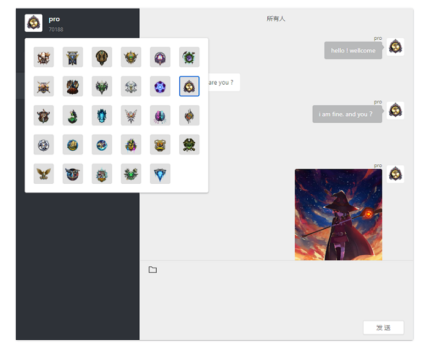

# Chat-Server_React
 Chat-Server, a tool for chatting and transferring files in the LAN writed by React&Javascript

 
### doc
<p align='left'>
  <b>Chat-Server based on socket.io</b>
</p>



### description
1.group chat is supported<br/>
2.LAN is supported<br/>
3.Can transfer pictures and documents<br/>
4.Support to change the Avatar<br/>
5.One person starts, multi person use<br/>

<b>notice：</b>
```
IE is not supported temporarily
```

### install

```sh
$ git clone https://github.com/ThorinChen/Chat-Server_React.git
$ cd chat-server && npm install
```

### start

```sh
$ npm run start
# visit http://IP:4000
```

#### tool link
 **Chat-server Links：[click](https://github.com/ThorinChen/Chat-Server_React)**